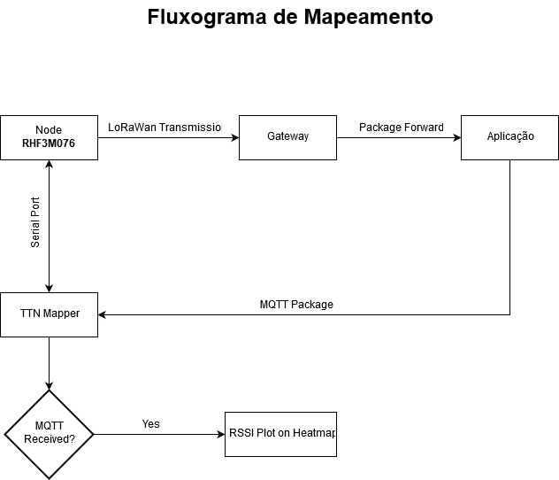

# ttnmapper
TTN Mapper modified to communicate with RisingHF LoRaWan Modem

Status: Under Development

Known bugs:
 - Trying to link a device using the login of The Things Network
 

Base aplication used:
https://github.com/ttnmapper/ttnmapper_android_v2

Serial library used:
https://github.com/felHR85/UsbSerial

